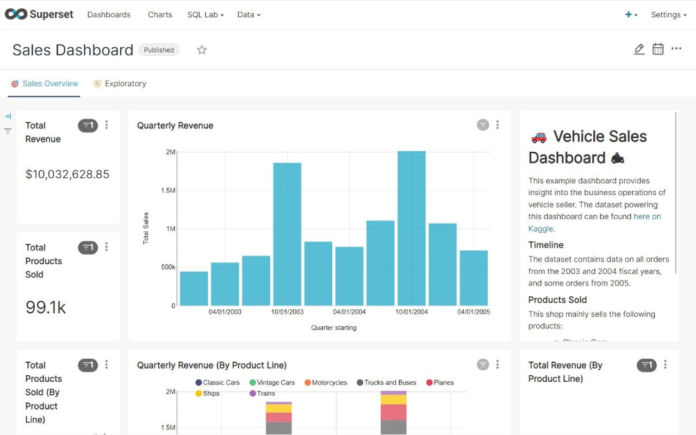

# Superset CI/CD pipeline

<a href="https://dash.elest.io/deploy?source=cicd&social=dockerCompose&url=https://github.com/elestio-examples/Superset"></a>

Deploy Superset with CI/CD on Elestio


<br/>
<br/>

# Once deployed ...

You can open Superset UI here:

    URL: https://[CI_CD_DOMAIN]
    email: [ADMIN_EMAIL]
    password: [ADMIN_PASSWORD]

# Install the database drivers and PyPI package

Follow these instructions to install the database drivers and Python packages:

1. Navigate to the Elestio dashboard.
2. Access the Superset Service.
3. Go to Tools and select "Launch VS CODE."
4. Open the file `requirements-local.txt` located within the `docker` directory.
5. Append the name of the package you wish to add.
6. Open the terminal and execute the provided command to restart the container. 
```bash
    docker-compose down;
    docker-compose up -d;
```
